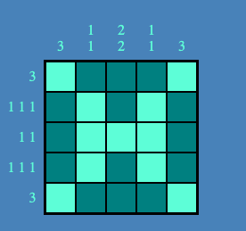

# Picross

## Background and Overview

-   Picross, also known as Nonograms, is a puzzle game that uses numbers to form a picture on a grid. Along the top and left sides of the grid are a series of numbers that let you know how many blocks are filled in and how those blocks are spaced. By combining the information given from the rows and columns, players can fill in the grid to form a picture.  
    

## Functionality and MVPS

-   In this version of picross, players will be able to
    -   Click on squares in the grid to fill them in.
    -   Right click on squares to X them out, marking them as "empty" spaces.
    -   Middle click on a square to mark it as a "maybe"
    -   (There will also be buttons to switch between modes for non-mouse users)
    -   The puzzles will get progressively harder as the player continues.
    -   The first level will be a tutorial so new players can learn how to play.
-   Bonus:
    -   Possibly a story to weave it all together?

## Architecture and Technology

- This project will be built using just vanilla javascript, HTML, and CSS/SCSS.

## Bonus Features

-   A narrative

## Sources

-   Background provided by <a href='https://www.freepik.com/vectors/background'>Background vector created by vectorpocket - www.freepik.com</a>
-   X is from http://clipart-library.com/clipart/gie5B478T.htm
-   Question mark from https://www.cleanpng.com/png-question-mark-pink-magenta-clip-art-color-question-1388903/download-png.html
-   icons from fontawesome
    https://fontawesome.com/icons/github-square?style=brands
